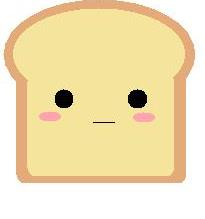

# Toast
</img>
Toast is a library designed to simplify making XMLHttpRequests.  I've found myself including jquery just for ajax many times and thats a huge amount of overhead. I wanted to create a library that simplifies making these requests while still being lightweight and simple.

# Usage

Using Toast is really easy.  

Step 1:
Include the javascript file list under the dist folder in your webpage.
```html
<script src="dist/toast-1.0.0.min.js"></script>
```
Step 2:
Make requests.  You can make calls to toast either listing your parameters in a comma separated way, or using an options JSON object.  Here are some sample ones:

**You can give parameters in a comma separated form**
```javascript

// Response is plain text
// Errors are logged to console.error because the second parameter is the failure callback
// url, success, fail
Toast.get("sample.html",alert, console.error);

// Response is parsed into json form 'sample.json'
// Errors are logged to console.error
//  url, success, fail
Toast.getJSON("sample.json",alert, console.error);

```
**You can also give your options in an object**
```javascript

//plain text
Toast.get({
    url:"sample.html",
    success:alert,
    fail:console.error
});

//json
Toast.getJSON({
    url:"sample.json",
    success:alert,
    fail:console.error
});

```
**Post requests only support the object style of passing parameters**
```javascript
Toast.post({
    url:"test.php",
    params:{
        "param1":true
    },
    success:alert,
    fail:console.error
});
```
Note:  Parameters are encoded into the url, support for JSON in the body is coming in release 1.0.1

# Mascot
The current mascot is taken from an image labeled for reuse without modification by kusodesign
http://kusodesign.deviantart.com/art/Pancake-and-Butter-441201321

# MIT License

Copyright (c) 2016 Luke Wood

Permission is hereby granted, free of charge, to any person obtaining a copy of this software and associated documentation files (the "Software"), to deal in the Software without restriction, including without limitation the rights to use, copy, modify, merge, publish, distribute, sublicense, and/or sell copies of the Software, and to permit persons to whom the Software is furnished to do so, subject to the following conditions:

The above copyright notice and this permission notice shall be included in all copies or substantial portions of the Software.

THE SOFTWARE IS PROVIDED "AS IS", WITHOUT WARRANTY OF ANY KIND, EXPRESS OR IMPLIED, INCLUDING BUT NOT LIMITED TO THE WARRANTIES OF MERCHANTABILITY, FITNESS FOR A PARTICULAR PURPOSE AND NONINFRINGEMENT. IN NO EVENT SHALL THE AUTHORS OR COPYRIGHT HOLDERS BE LIABLE FOR ANY CLAIM, DAMAGES OR OTHER LIABILITY, WHETHER IN AN ACTION OF CONTRACT, TORT OR OTHERWISE, ARISING FROM, OUT OF OR IN CONNECTION WITH THE SOFTWARE OR THE USE OR OTHER DEALINGS IN THE SOFTWARE.
